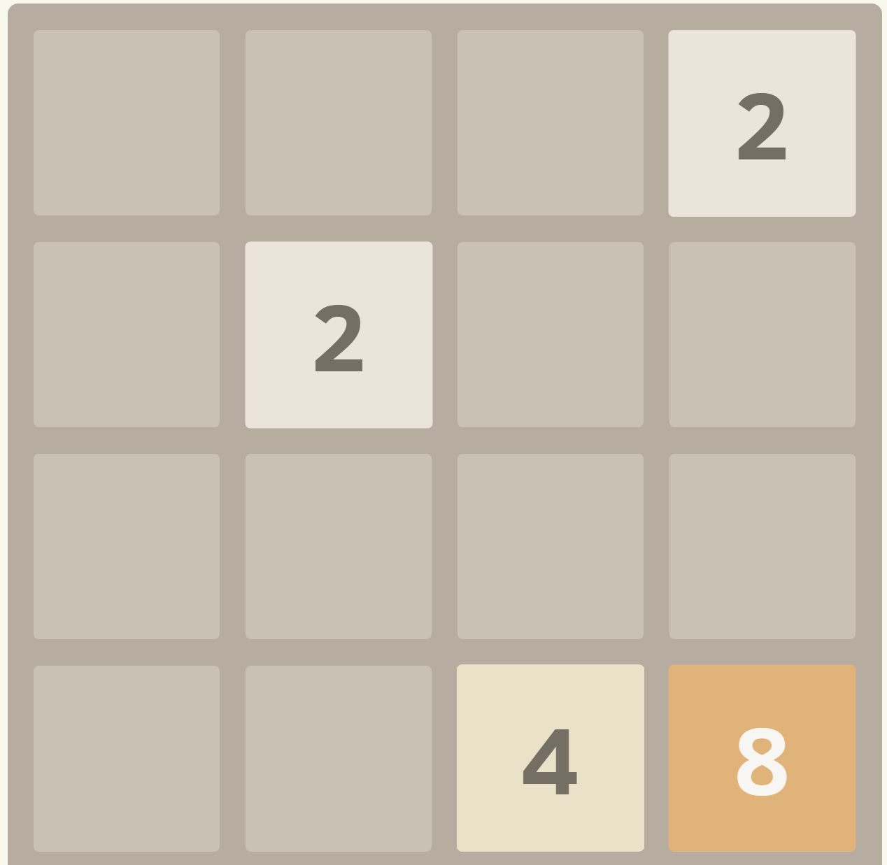
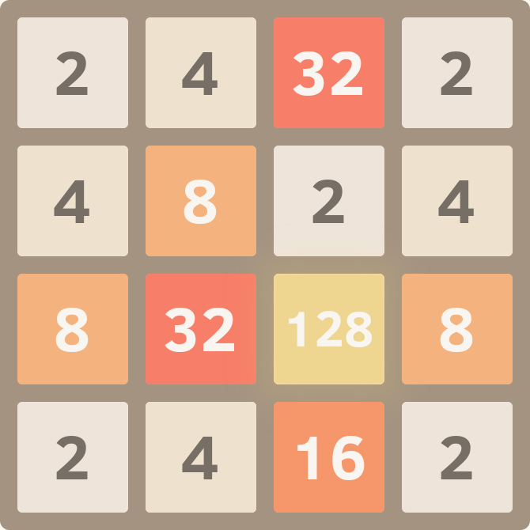
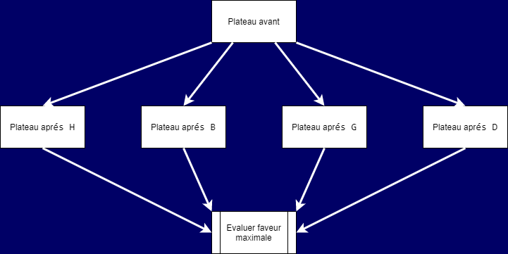

---
jupytext:
  text_representation:
    extension: .md
    format_name: myst
    format_version: 0.13
    jupytext_version: 1.13.1
kernelspec:
  display_name: Python 3 (ipykernel)
  language: python
  name: python3
---

# Rapport de projet

<!-- *Les paragraphes en italique comme celui-ci vous donnent des
indications sur le contenu attendu; ils sont à supprimer une fois
votre rapport rédigé*

*Ce rapport pourra servir de support pour votre présentation orale*

*Soyez objectifs et factuels! Vous ne serez pas évalué sur ce que vous
affirmez, mais sur la pertinence et la justesse de ce que vous
affirmez.* -->

## Introduction :
Ce projet est un jeu de 2048 programmé en C++ faisant office de capstone au cours de programmation impérative <a href="https://nicolas.thiery.name/Enseignement/Info111/index.html">Info-111</a> offert en L1 à l'Université Paris-Saclay. <br><br>En guise d'approfondissement, nous avons choisi de programmer une Intelligence Artificielle qui joue au 2048.

<br>

------

<br>

## Description du jeu :

<br>

- Le jeu se joue sur un plateau 4 × 4 où chaque case est soit vide, soit contient une puissance de 2, inscrite sur une tuile.

<p align="center">
  <br>
  <i>Exemple d'un plateau en milieu de partie.</i>
</p>

- Le jeu débute avec deux tuiles posées sur le plateau, tirées selon les probabilités suivantes: <ul><li><sup>9</sup>/<sub>10</sub> d'avoir un 2.</li><li><sup>1</sup>/<sub>10</sub> d'avoir un 4.</li></ul>

<p align="center">
  
  
  <br><i>Deux exemples de plateaux en début de partie.</i>
</p>

- Le joueur peut déplacer les tuiles en les faisant glisser toutes ensemble dans une même direction (haut, bas, droite, gauche).
- Les tuiles ne peuvent dépasser les bords du plateau.
- Si deux tuiles de même valeur 2<sup>k</sup> sont adjacentes pendant le glissement, alors elles se combinent en une unique tuile etiquetée par la somme des valeurs ( 2<sup>k+1</sup> ) .

<p align="center">
  
  
  
  
  
  <br>
  <i>Exemple des 6 premiers plateaux d'une partie,<br> l'utilisateur à ici joué dans l'ordre:<br> Droite - Bas - Bas - Bas - Droite </i>
</p>

- Le but du jeu est de créer une tuile portant le numero 2048. 

<p align="center">
  <br>
  <i>Cependant, on pourra continuer à jouer apres avoir atteint le but, en créant des tuiles avec des numéros plus grands et ainsi ameliorer indéfiniment son score.*</i><br> <br>

</p>

- \* : la tuile maximum est 2<sup>17</sup>=131072

<p align="center">
  <br>
  <i>La partie est terminée, on ne peut plus combiner de tuiles.</i>
</p>

- Le jeu se termine lorsque toutes les tuiles sont occupées et que plus aucun mouvement ne permet de combiner de tuiles.

<p align="center">
  <br>
  <i>On observe bien que la partie est perdue, aucun déplacement ne modifie le plateau et il n'y à aucune tuile 2048.</i>
</p>
<br>

- Chaque combinaison de tuiles rapporte au joueur un nombre de point équivalent à la valeur de la tuile aprés la combinaison.


<p align="center" style="display:inline-block">
  
  
  
  
  
  
  
  <i style="width:50%"><b>Exemple:</b> On observe l'augmentation du score lors des combinaisons de cases. </i>
</p><br><br><br><br><br><br><br><br><br><br><br>
<br>

------

<br>
<br>
<br>
<br>

## Auteurs :
<br>

| Nom  | Prénom | Courriel | Groupe| Github |
| :-------------: | :-------------: | :-------------: | :-------------: | :-------------: |
| AIT BELKACEM  | Moncef Karim  | moncef.ait-belkacem@universite-paris-saclay.fr  | LDDIM2  |https://github.com/MK8BK|
| Chulilla-Aragon  | Pablo  | pablo.chulilla-aragon@universite-paris-saclay.fr  | LDDIM2  |https://github.com/pablo-chulilla|


<br>

------

<br>

## Résumé du travail effectué :

<!-- *Pour chaque niveau du sujet, décrire brièvement l'avancement de votre
projet. Exemples de réponses: «non traitée», «réalisée, documentée,
testée», «réalisée, sauf 2.3», «réalisée mais non testée», «réalisée
sauf 2.4 pour lequel notre programme ne compile pas». Pour les
questions «Aller plus loin» plus ouvertes, décrire plus en détail ce
que vous avez choisi de réaliser.*

*En plus du rapport, la documentation de chaque fonction dans le code
devra préciser son auteur et votre degré de confiance dans
l'implantation et les éléments factuels motivant cette confiance:
présence de tests, bogues et limitations connus, etc.* -->

**Niveau 0** : réalisée , documentée , testée.

**Niveau 1** : réalisée , documentée , testée.

**Niveau 2** : réalisée , documentée , testée.

**Niveau 3** **IA**:  réalisée, testée, à optimiser.

<br>

------

<br>

## Détails du travail effectué :

Nous regroupons ici les extraits les plus intéressants de chaque niveau.

Pour des raisons d'esthétique, nous utilisons du pseudo-code.

**Niveau 0 :**

Afin d'effectuer le déplacement vers la gauche d'un plateau, on implémente une fonction `collapseRowLeft()` et une fonction `mergeRowLeft()` qui nous pemettent d'effectuer le déplacement en trois étapes:
```{code-cell}
//deplacement vers la gauche d'un plateau

Pour chaque ligne du plateau:
    collapseRowLeft(ligne)
    mergeRowLeft(ligne);
    collapseRowleft(ligne);
```

On peut ensuite définir les trois autres deplacements en fonction du `deplacementGauche()` en créant une fonction `flippe90TrigPlus()` qui effectue la rotation d'un plateau de 90° dans le sens trigonometrique. Ainsi:
```{code-cell}
//deplacement vers la droite d'un plateau

flippe90TrigPlus(plateau)
flippe90TrigPlus(plateau)
deplacementGauche(plateau)
flippe90TrigPlus(plateau)
flippe90TrigPlus(plateau)

//deplacement vers le haut d'un plateau

flippe90TrigPlus(plateau)
deplacementGauche(plateau)
flippe90TrigPlus(plateau)
flippe90TrigPlus(plateau)
flippe90TrigPlus(plateau)

//deplacement vers le bas d'un plateau

flippe90TrigPlus(plateau)
deplacementDroite(plateau)
flippe90TrigPlus(plateau)
flippe90TrigPlus(plateau)
flippe90TrigPlus(plateau)
```

Définition d'une fonction `nouvelleTuile()` qui rajoute une nouvelle tuile à un plateau.

Aussi: définition d'une fonction `jeu()` afin de limiter la maintenance requise de `2048.cpp` .

**Niveau 1 :**

Utilisation de system("clear") afin de rafraichir l'écran du terminal.

Utilisation de la bibliothèque `<ncurses.h>` pour l'implémentation des couleurs mais aussi des flèches. À cet effet, création de deux variantes de la fonction `jeu()`: 
- `jeu_moderne()` : avec flèches.
- `jeu_moderne_couleur()` : avec flèches et couleurs.

Le but étant d'offrir le maximum de fonctionnalités sans provoquer de bugs *(exemple: terminal ne supportant pas de couleurs)*.

Définition de la fonction `score()` par récurrence:
```{code-celle}
score( ancien score , ancien plateau , nouveau plateau ):
    pour toute puissance de deux allant de 2^1 à 2^17:
        si l'occurence de cette puissance augmente suite au deplacement: 
            ajouter son double*l'augmentation au score
        si l'occurence de cette puissance reste la meme, mais que l'occurence de son double augmente:
          ajouter sa valeur*l'augmentation de son double*2

```
<i>NB: création d'une fonction deplacement() légérement modifiée, afin d'effectuer un déplacement sans ajouter de nouvelle tuile.</i>

**Niveau 2 :**

Utilisation de git comme système de contrôle de version.

Utilisation de Github pour le stockage du repositoire @<a href="https://github.com/MK8BK/ldd2048s1">lien</a>.

Utilisation d'un makefile pour le jeu 2048 et pour l'IA

**Niveau 3 :**

Nous avons decidé de programmer une IA.

L'IA reçoit un plateau à l'iteration N, effectue ses déplacements possibles, attribue un score à chacun de ses déplacements, et enfin selectionne le plus avantageux. Biensur le communique au simulateur.

Voici un diagramme explicatif.

<p align="center">
  <br>
  <i>Diagramme de l'algorithme de l'IA.</i><br> <br>
</p>

l'IA est composée de 4 parties:

  - modele (fonctions de base requises pour le déplacement d'un plateau).
  - io (fonctions d'entrées et de sorties requises pour la lecture et la communication des déplacements).
  - helper (fonctions auxiliaires qui permettent de décomposer le choix du déplacement).
  - favor (fonctions faveurs, attribuent des scores sur différentes caractéristiques d'un plateau transformé).

Voici un diagramme explicatif.

<p align="center">
  <br>
  <i>Diagramme de la structure de l'IA et son interaction avec le simulateur.</i><br> <br>
</p>

Les critères d'évaluation de la faveur d'un déplacement sont exprimées par quatre fonctions:
  - `decroissance_favor()` (Le degré de formation d'une chaine décroissante en serpentin sur le plateau)
  - `adjacency_favor()` (l'adjacence des tuiles entre elles).
  - `stability_favor()` (le taux de changement du plateau, evite les mélanges excessifs)
  - `incremented_score_favor()` (l'augmentation du score).

<p align="center">
  <br>
  <i>exemples variés de différents degrés de formation d'une chaine décroissante en serpentin sur le plateau</i><br> <br>
</p>


Ces fonctions sont appelées par la fonction `eval_move()`, qui leur attribue à chacune un poids w<sub>n</sub> qu'elle lit dans un fichier w.txt (ce qui permet de considérables optimisations).

À son tour, la fonction `eval_move()` est appelée par la fonction `ai_answer()`. Cette fonction évalue les quatres déplacements et renvoie le plus avantageux. La fonction `main()` de `2048_IA.cpp` se charge ensuite de l'incrémentation du numéro d'iteration et de l'écriture de la réponse. La balle est dans le camp du simulateur.

**Résultats:**

<p align="center">
  <br>
  <i>Quelques résultats avec trés peu d'optimisation.</i><br> <br>
</p>

L'IA arrive presque toujours à au moins 512, et <sup>1</sup>/<sub>3</sub> à 1024.

Ces résultats ne sont pas encore assez concluants, des optimisations devront être effectuées. Aussi peut-être l'ajout de nouvelles fonctions de faveur, ou la supression de certaines.  


Du fait de ces scores peu encourageants, nous avons choisi le nom suivant pour l'IA lors du tournois: `BET`
<br>

------

<br>

## Démonstration
<!-- 
*Soutenez ce que vous affirmez dans la section précédente au moyen de
quelques exemples **bien choisis**. Vous pourrez par exemple compiler et
lancer certains de vos programmes, lancer des tests, etc.*

*À titre d'inspiration, vous trouverez ci-dessous comment compiler un
programme du projet depuis cette feuille. Notez comment on lance une
commande shell en la préfixant d'un point d'exclamation.*

*Ne gardez que des exemples pertinents qui mettent en valeur votre
travail. Inutile de perdre du temps sur le premier programme si vous
avez fait les suivants plus compliqués; l'auditeur se doutera bien que
vous avez réussi à le faire.* -->
Pour le jeu :
```{code-cell} ipython3
cd 12/ && make clean && make && ./2048 && cd ..
```

<br>

Petite présentation orales et visuelles des fonctions `eval_move()` et `decroissance_favor()`.

<br>

Pour l'IA :
```{code-cell} ipython3
//ouvrir deux terminaux et naviguer vers le repositoire

//dans le premier
cd /archive/tournois && ./tournois_simulation

//dans le deuxieme
cd ia/ && make clean && make && ./2048_IA
```

<br>

------

<br>

## Organisation du travail

<!-- *Décrire en quelques phrases comment vous vous êtes organisés pour
travailler sur le projet: nombre d'heures consacrées au projet,
répartition du travail dans le binôme, moyens mis en œuvre pour
collaborer, etc. Si vous avez bénéficié d'aide (en dehors de celle
de vos enseigants), précisez le.* -->

Nombre d'heures: 

- niveau 0: 16 heures.
- niveau 1: 4 heures.
- niveaux 2: 0 heures (déja implémenté).
- niveau 3 14 heures.

Répartition du travail:
- niveau 0: Moncef.
- niveau 1: Pablo.
- niveau 2: ...(déja implémenté).
- niveau 3: Algorithmie Moncef - stratégie de jeu collaborative.

Moyens de collaboration:
  - Discussions Github.
  - Issues Github.
  - Discord.
  - Bibliothèque Universitaire.

<p align="center">
  <br>
  <i>Historique des contributions: Moncef - Pablo 2021</i><br> <br>
</p>


<br>

------

<br>

## Prise de recul

<!-- *Décrire en quelques phrases les difficultés rencontrées, ce que vous
avez appris à l'occasion du projet, le cas échéant comment vous vous y
prendriez si vous aviez à le refaire.* -->

Les difficultés:
  - L'IA n'est toujours pas satisfaisante.

 Ce que nous avons appris:
  - L'importance de la modularité.
  - L'importance des tests.
  - Gestion du temps et des priorités.
  - La nécessité de la collaboration.
  - Développement des capacités de problem-solving.
  - Développement des capacités de problem-creating.
